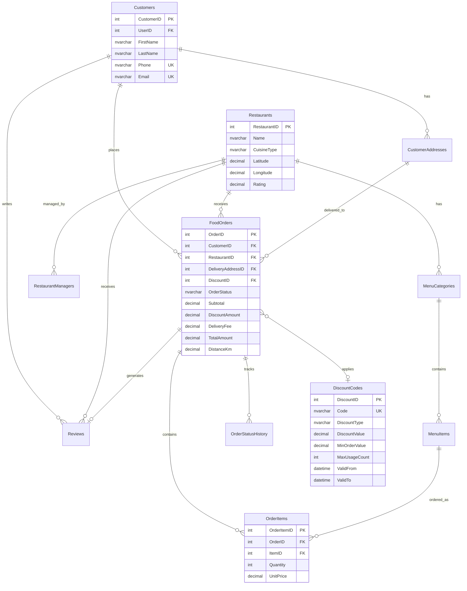
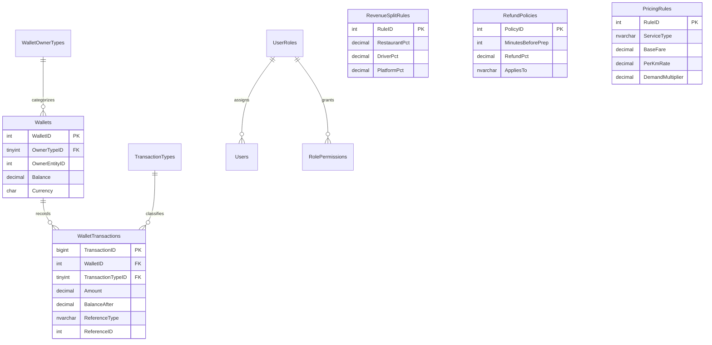

# SnapDB Project Proposal

**Course:** Database Systems  
**Team Repository:** [github.com/azita121/snap-db-project](https://github.com/azita121/snap-db-project)  
**Date:** July 2026

---

## 1. Executive Summary

SnapDB is an integrated database platform combining **SnapFood** (online food ordering) and **SnapTaxi** (taxi and delivery fleet management). The two schemas operate independently yet interact through stored procedures and triggers: when a customer places a food delivery order, SnapTaxi automatically assigns the nearest available online driver to fulfill the delivery.

A shared **SnapFinance** schema manages four distinct wallet types (Customer, Restaurant, Driver, Platform), dynamic pricing, revenue splits, and refund policies.

---

## 2. Chosen Topics & User Needs

### 2.1 SnapFood — Online Food Ordering

**Users:** Customers, Restaurant Managers, Platform Admins

**Needs addressed:**
- Browse restaurant menus by category
- Place orders with multiple items
- Apply validated discount/voucher codes
- Track order status from placement to delivery
- Pay via digital wallet with automatic revenue distribution
- Cancel orders with time-based refund policies
- Leave reviews after delivery

### 2.2 SnapTaxi — Delivery Fleet & Ride Service

**Users:** Drivers, Customers (for standalone rides), Platform Admins

**Needs addressed:**
- Real-time driver location tracking
- Online/idle availability management
- Nearest-driver allocation for food deliveries and rides
- Dynamic fare calculation based on distance, zone surge, and demand
- Delivery assignment linked to food orders (cross-schema)
- Ride lifecycle management (request → assign → complete)

### 2.3 SnapFinance — Shared Financial Layer

**Needs addressed:**
- Four wallet types with immutable transaction ledger
- Configurable revenue split rules (70/20/10 default)
- Dynamic delivery and ride pricing
- Refund policies based on cancellation timing
- Role-based access control (Admin, Customer, Restaurant Manager, Driver)

---

## 3. Entity-Relationship Diagrams

### 3.1 SnapFood ER Diagram



### 3.2 SnapTaxi ER Diagram

```mermaid
erDiagram
    Drivers ||--o{ Vehicles : operates
    Drivers ||--|| DriverAvailability : has
    Drivers ||--o{ DriverLocations : reports
    Drivers ||--o{ Rides : performs
    Drivers ||--o{ DeliveryAssignments : assigned
    VehicleTypes ||--o{ Vehicles : classifies
    DeliveryZones ||--o{ ZonePricing : priced_in
    DeliveryZones ||--o{ DemandMetrics : measured_in
    Rides ||--o{ RideStatusHistory : tracks
    FoodOrders ||--o| DeliveryAssignments : fulfilled_by

    Drivers {
        int DriverID PK
        int UserID FK
        nvarchar FirstName
        nvarchar LastName
        nvarchar LicenseNumber UK
        decimal Rating
    }

    DriverAvailability {
        int AvailabilityID PK
        int DriverID FK UK
        bit IsOnline
        bit IsIdle
        int CurrentZoneID FK
    }

    DeliveryAssignments {
        int AssignmentID PK
        int FoodOrderID FK UK
        int DriverID FK
        int RideID FK
        nvarchar AssignmentStatus
    }

    Rides {
        int RideID PK
        int DriverID FK
        decimal DistanceKm
        nvarchar RideStatus
        decimal TotalFare
    }

    DeliveryZones {
        int ZoneID PK
        nvarchar ZoneName UK
        decimal CenterLatitude
        decimal CenterLongitude
        decimal RadiusKm
    }
```

### 3.3 SnapFinance ER Diagram



### 3.4 Cross-Schema Interaction

```
┌─────────────┐     usp_FinalizeFoodOrder      ┌─────────────┐
│  SnapFood   │ ─────────────────────────────► │  SnapTaxi   │
│  FoodOrders │     usp_AssignNearestDriver    │  Delivery   │
└─────────────┘                                │  Assignments│
       │                                       └─────────────┘
       │ trg_FoodOrders_OnConfirmed                   │
       └──────────────────────────────────────────────┘
                          │
                          ▼
                   ┌─────────────┐
                   │ SnapFinance │
                   │   Wallets   │
                   └─────────────┘
```

---

## 4. Normalization & 3NF Compliance

All tables satisfy **Third Normal Form (3NF)**: every non-key attribute depends only on the primary key, and there are no transitive dependencies.

### Example 1: `SnapFood.FoodOrders`

| Attribute | Dependency | 3NF Status |
|-----------|------------|------------|
| OrderID → CustomerID | Direct FK to Customers | ✓ |
| OrderID → Subtotal, TotalAmount | Derived at order level, not from other non-keys | ✓ |
| Customer name/phone | Stored in `Customers`, not duplicated in orders | ✓ |

**Why not denormalize?** Storing customer name in `FoodOrders` would create update anomalies if the customer changes their name.

### Example 2: `SnapFood.OrderItems`

| Attribute | Dependency | 3NF Status |
|-----------|------------|------------|
| OrderItemID → UnitPrice | Price at time of order (historical snapshot) | ✓ |
| OrderItemID → ItemID | FK to MenuItems for reference only | ✓ |
| LineTotal | Computed column (Quantity × UnitPrice) | ✓ |

**Why store UnitPrice?** Menu prices change; order history must reflect the price at purchase time (2NF/3NF compliant snapshot).

### Example 3: `SnapFinance.Wallets`

| Attribute | Dependency | 3NF Status |
|-----------|------------|------------|
| WalletID → Balance | Direct attribute | ✓ |
| OwnerTypeID + OwnerEntityID | Composite unique, resolves to one entity | ✓ |
| Transaction details | Stored in `WalletTransactions`, not in Wallets | ✓ |

**Why separate transactions?** Balance is aggregate state; individual debits/credits belong in a separate table (1NF repeating groups avoided).

### Example 4: `SnapTaxi.DriverLocations`

Location history is append-only (one row per GPS ping). Current location is retrieved via `TOP 1 ORDER BY RecordedAt DESC`, avoiding redundant "current lat/lng" columns on `Drivers` that would violate 3NF update rules.

---

## 5. Table Inventory

| Schema | Table | Purpose |
|--------|-------|---------|
| SnapFood | Customers | Customer profiles |
| SnapFood | Restaurants | Restaurant master data |
| SnapFood | RestaurantManagers | Manager-restaurant mapping |
| SnapFood | MenuCategories | Menu organization |
| SnapFood | MenuItems | Individual dishes |
| SnapFood | CustomerAddresses | Delivery addresses |
| SnapFood | DiscountCodes | Promotional codes |
| SnapFood | FoodOrders | Order headers |
| SnapFood | OrderItems | Line items |
| SnapFood | OrderStatusHistory | Status audit trail |
| SnapFood | Reviews | Post-delivery ratings |
| SnapFood | FoodAuditLog | Trigger-based event log |
| SnapTaxi | VehicleTypes | Vehicle classification |
| SnapTaxi | Drivers | Driver profiles |
| SnapTaxi | Vehicles | Driver vehicles |
| SnapTaxi | DeliveryZones | Geographic zones |
| SnapTaxi | ZonePricing | Zone surge pricing |
| SnapTaxi | DriverLocations | GPS history |
| SnapTaxi | DriverAvailability | Online/idle status |
| SnapTaxi | DemandMetrics | Supply/demand index |
| SnapTaxi | Rides | Ride records |
| SnapTaxi | RideStatusHistory | Ride status trail |
| SnapTaxi | DeliveryAssignments | Food order ↔ driver link |
| SnapTaxi | TaxiAuditLog | Trigger-based event log |
| SnapFinance | WalletOwnerTypes | Wallet type lookup |
| SnapFinance | Wallets | Balance storage |
| SnapFinance | WalletTransactions | Financial ledger |
| SnapFinance | RevenueSplitRules | Split configuration |
| SnapFinance | RefundPolicies | Cancellation rules |
| SnapFinance | PricingRules | Dynamic fare config |
| SnapFinance | UserRoles | RBAC roles |
| SnapFinance | RolePermissions | RBAC permissions |
| SnapFinance | Users | User accounts |
| SnapFinance | FinanceAuditLog | Financial audit trail |

**Total: 33 tables across 3 schemas** (12 SnapFood + 12 SnapTaxi + 9 SnapFinance)

---

## 6. Technology Stack

- **DBMS:** Microsoft SQL Server 2019+
- **Language:** T-SQL
- **Tools:** SSMS, sqlcmd, bcp (for export bonus)

---

## 7. Team Contribution Split (Suggested 50-50)

| Member | Responsibility |
|--------|----------------|
| Member A | SnapFood schema, food order procedures, discount validation, food triggers |
| Member B | SnapTaxi schema, driver allocation, dynamic pricing, cross-schema integration, SnapFinance wallets |

---

*Convert this document to PDF using: `pandoc docs/Proposal.md -o docs/Proposal.pdf`*
